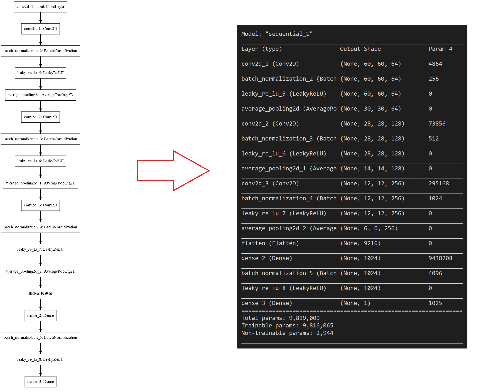
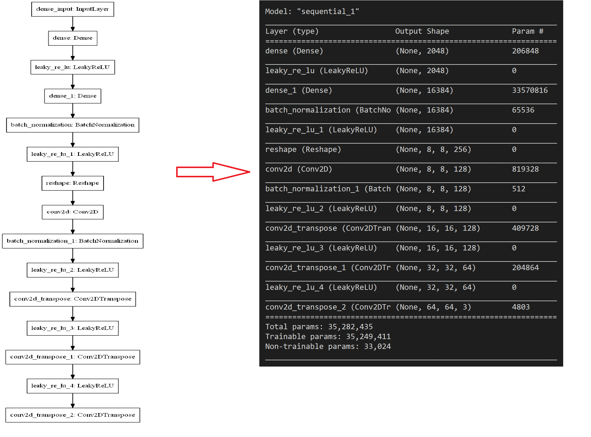
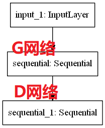

## 简介

**数据挖掘课程设计**：基于DCGAN自动生成动漫头像。

关于GAN网络获得DCGAN的相关知识，可以参考我的博客：[GAN网络入门](https://www.cnblogs.com/xiaohuiduan/category/1799415.html)，一共分为：

1. [GAN网络之入门教程（一）之GAN网络介绍](https://www.cnblogs.com/xiaohuiduan/p/13237486.html) 
2. [GAN网络之入门教程（二）之GAN原理](https://www.cnblogs.com/xiaohuiduan/p/13246139.html) 
3. [GAN网络之入门教程（三）之DCGAN原理](https://www.cnblogs.com/xiaohuiduan/p/13273389.html)
4. [GAN网络之入门教程（四）之基于DCGAN动漫头像生成](https://www.cnblogs.com/xiaohuiduan/p/13274675.html) 

其中[GAN网络之入门教程（四）之基于DCGAN动漫头像生成](https://www.cnblogs.com/xiaohuiduan/p/13274675.html) 是关于代码的解释。

## 数据集来源
数据集非本人收集，数据集来自Kaggle：[kaggle——Anime Faces](https://www.kaggle.com/soumikrakshit/anime-faces)

## 网络结构

### D网络

### G网络

### GAN网络

